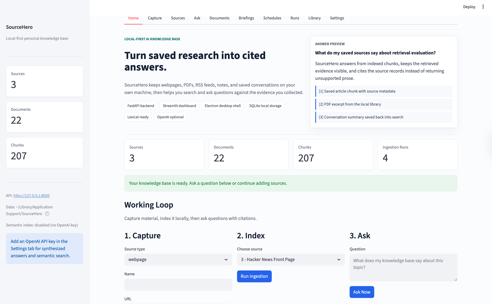
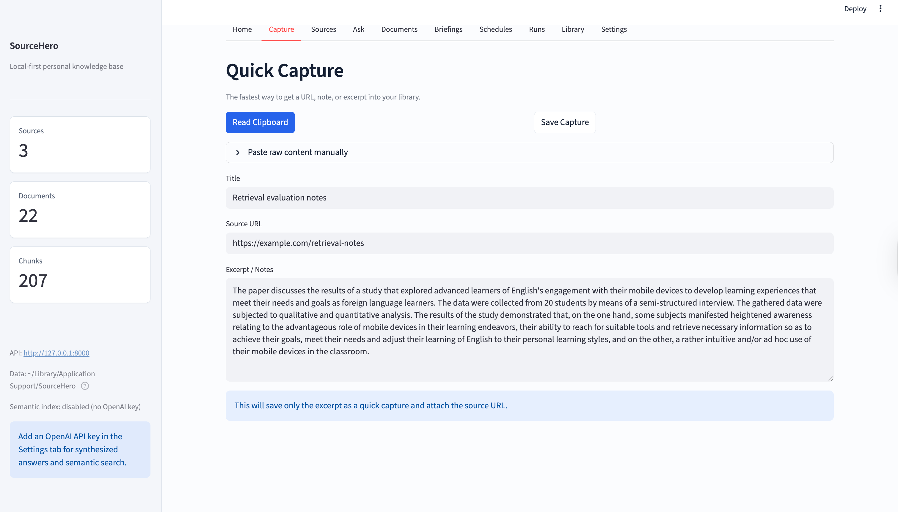
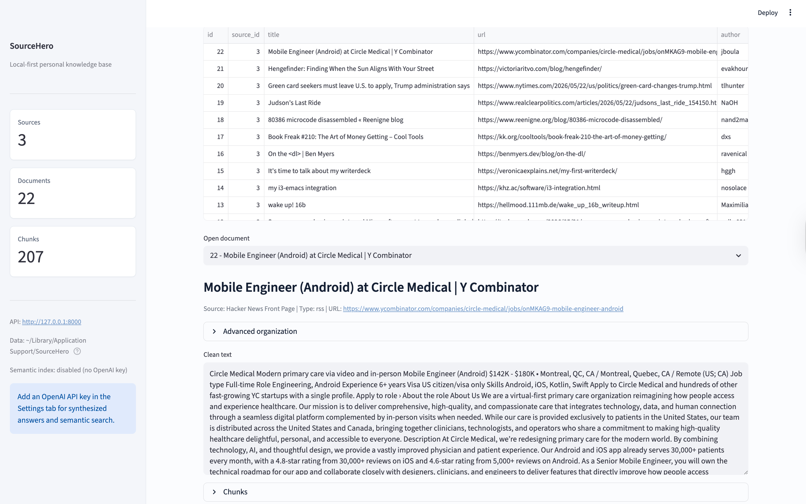
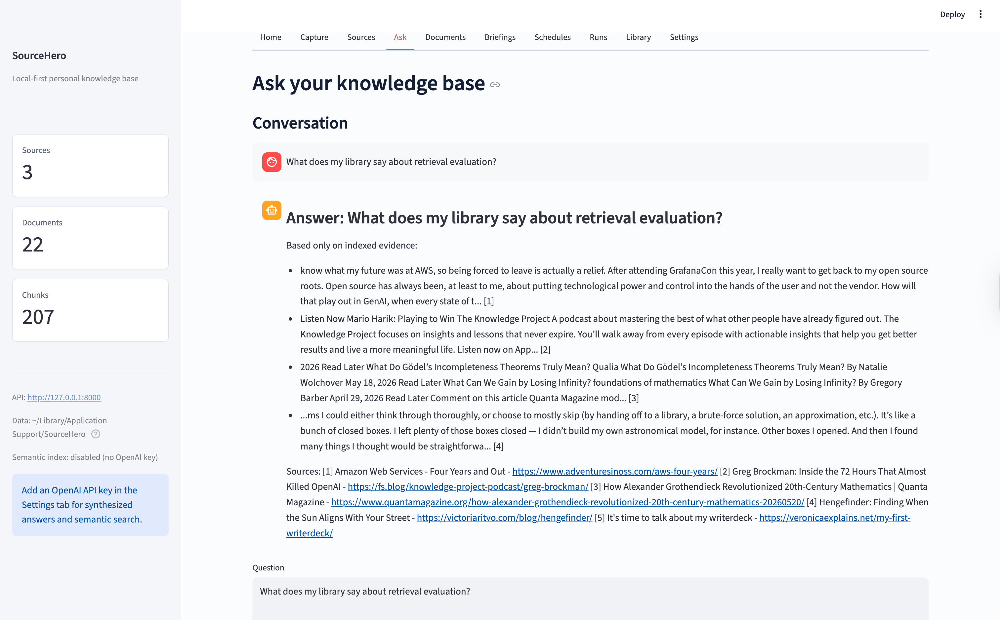
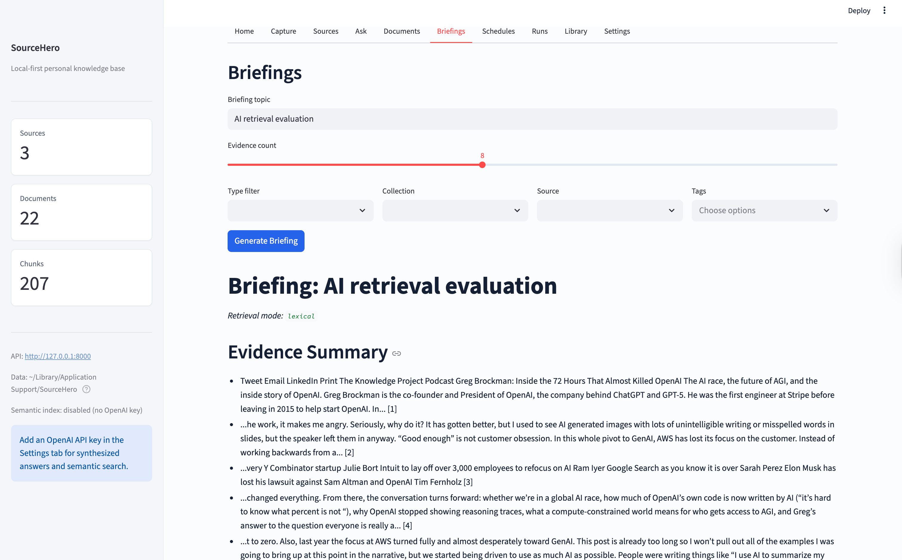
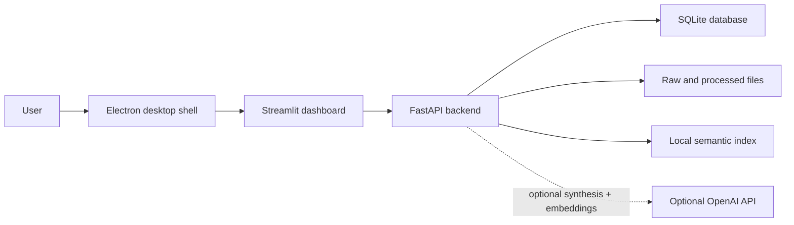

# SourceHero AI

SourceHero AI is a local-first AI knowledge base for people who save webpages, PDFs, RSS feeds, notes, and research threads, then later need reliable answers tied back to the original evidence.

It is not a general chatbot. It is a desktop research companion: capture material, index it locally, ask questions, and get cited answers from the sources you chose to trust.


## Project Snapshot

| Area | What SourceHero demonstrates |
|---|---|
| Product thinking | A focused local-first workflow for personal research instead of another open-ended chatbot |
| Backend | FastAPI service with ingestion, search, citations, schedules, settings, and health endpoints |
| Data layer | SQLite / SQLAlchemy persistence for sources, documents, chunks, tags, collections, runs, and saved conversations |
| Retrieval | Local lexical retrieval with optional OpenAI embeddings for hybrid semantic search |
| Desktop UX | Electron shell that starts the API and Streamlit dashboard, plus a dedicated Quick Capture window |
| Reliability | Focused tests around ingestion, deduplication, citations, settings, schedules, dashboard rendering, and pipeline failures |

For a shorter recruiter-facing writeup, see [docs/PROJECT_BRIEF.md](docs/PROJECT_BRIEF.md).

## Product Walkthrough

The first screen gives a reviewer the product positioning, live library status, and the core capture-index-ask loop.



### 1. Capture

Save a webpage, RSS feed, PDF, clipboard URL, article excerpt, quick note, or previous conversation.



### 2. Index

SourceHero cleans, chunks, deduplicates, and stores the content locally. Every document stays connected to its source metadata.



### 3. Ask

Ask a question and receive an answer grounded in indexed evidence, with citations and retrieved hits visible for inspection.



### 4. Reuse

Generate briefings, save useful conversations back into the library, and schedule recurring ingestion or briefing jobs while the app is running.



## Architecture



## Engineering Highlights

- Built a local-first RAG-style system that still works without an API key by falling back to lexical retrieval and extractive cited answers.
- Designed ingestion for multiple source types: webpages, RSS feeds, PDFs, saved conversations, and quick captures.
- Added deduplication and chunking so repeated captures do not inflate the library or search index.
- Kept OpenAI integration optional and configurable in-app, with local storage for user settings.
- Added an Electron desktop shell that manages the Python backend and Streamlit dashboard as one app-like experience.
- Implemented schedules for recurring ingestion and briefing generation while the app is running.
- Added first-run demo seeding so a reviewer can understand the product without bringing their own sources.
- Covered the core workflow with tests for ingestion, retrieval, citations, settings, schedules, dashboard rendering, and failure handling.

## Current Feature Set

- Ingest webpages, RSS feeds, PDFs, quick captures, and saved conversations
- Store the full library locally in SQLite
- Organize sources and documents with collections and tags
- Search with filters for source, type, collection, and tags
- Blend lexical search with optional semantic retrieval when an OpenAI key is configured
- Answer questions with citations instead of free-floating guesses
- Generate evidence-grounded briefings
- Save recurring briefing and ingestion schedules
- Run as a desktop app through Electron on macOS and Windows
- Configure the OpenAI key and model inside the app

## Quick Start

### macOS

Install:

- Python 3.11 or newer
- Node.js LTS

Then open:

```text
Install-SourceHero.command
```

When setup finishes, launch:

```text
Start-SourceHero.command
```

If Gatekeeper complains the first time, right-click and choose **Open**.

### Windows

Install:

- Python 3.11 or newer
- Node.js LTS

Then open:

```text
Install-SourceHero.bat
```

When setup finishes, launch:

```text
Start-SourceHero.bat
```

## First Run Demo

If the library is empty, SourceHero shows a first-run welcome flow.

1. Choose `Try the demo` to seed example sources and index them.
2. Open the `Ask` tab.
3. Ask a question.
4. Inspect the answer, hits, and citations.
5. Save useful conversations back into the library.

## OpenAI Is Optional

You do not need an OpenAI key to use SourceHero.

Without a key, the app still:

- ingests content
- searches locally
- returns extractive answers with citations

With a key configured, the app can also:

- synthesize more natural answers
- build and use semantic embeddings
- rebuild the local semantic index

You can configure the key either in the Settings tab or through `OPENAI_API_KEY`.

Recommended default model:

```text
OPENAI_MODEL=gpt-5.4-mini
```

## Running As A Developer

```bash
git clone https://github.com/JeremyL691/SourceHero-AI.git
cd SourceHero-AI

python3.11 -m venv .venv
source .venv/bin/activate

python -m pip install -U pip
python -m pip install -e ".[dev]"
cp .env.example .env
```

Optional env vars:

```text
OPENAI_API_KEY=
OPENAI_MODEL=gpt-5.4-mini
SOURCEHERO_API_PORT=8000
SOURCEHERO_DASHBOARD_PORT=8501
# SOURCEHERO_DATA_DIR=/portable/path
```

Start the desktop shell:

```bash
cd desktop
npm install
npm run dev
```

Or run the services directly:

```bash
uvicorn app.main:app --reload --host 127.0.0.1 --port 8000
streamlit run dashboard/streamlit_app.py
```

Useful local URLs:

- Dashboard: [http://localhost:8501](http://localhost:8501)
- API docs: [http://127.0.0.1:8000/docs](http://127.0.0.1:8000/docs)

## Data Location

SourceHero stores user data in the normal per-user app location for each platform.

- macOS: `~/Library/Application Support/SourceHero/`
- Windows: `%APPDATA%\\SourceHero\\`
- Linux: `~/.local/share/SourceHero/`

That directory holds:

- the SQLite database
- raw and processed files
- the local semantic index
- logs
- `user_config.json`

You can override the location with `SOURCEHERO_DATA_DIR`.

## API Highlights

| Method | Path | Purpose |
|---|---|---|
| `GET` | `/health` | Runtime health, stats, OpenAI status, semantic index status |
| `GET` | `/index/status` | Local semantic index coverage and readiness |
| `POST` | `/index/rebuild` | Rebuild embeddings for the current chunk corpus |
| `POST` | `/sources` | Add a source |
| `POST` | `/sources/{source_id}/ingest` | Run ingestion |
| `GET` | `/capture/clipboard` | Read and classify clipboard text |
| `POST` | `/captures/parse` | Parse pasted raw capture text |
| `POST` | `/captures` | Save a quick capture or URL |
| `POST` | `/search` | Search or ask with citations |
| `POST` | `/briefings` | Generate a cited briefing |
| `GET` | `/schedules` | List recurring jobs |
| `POST` | `/schedules` | Create a recurring ingest or briefing job |
| `POST` | `/conversations/save` | Save a conversation back into the library |

Example search:

```bash
curl -s -X POST http://127.0.0.1:8000/search \
  -H "Content-Type: application/json" \
  -d '{
    "query": "What do my sources say about retrieval evaluation?",
    "top_k": 5,
    "retrieval_mode": "hybrid",
    "source_type": "webpage",
    "tags": ["retrieval"]
  }'
```

## Testing

Run the Python suite:

```bash
.venv/bin/pytest -q
```

Run the Electron smoke check:

```bash
cd desktop
npm run smoke
```

## Roadmap

- Add polished screenshots and a short demo GIF to the README
- Improve export workflows for saved research
- Add browser capture extensions or share-sheet style capture
- Strengthen packaging, signing, CI, and release automation
- Add more opinionated research workflows on top of the storage and retrieval loop

## License

MIT. See [LICENSE](LICENSE).
